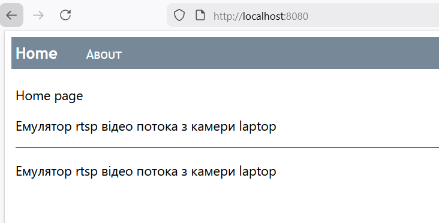
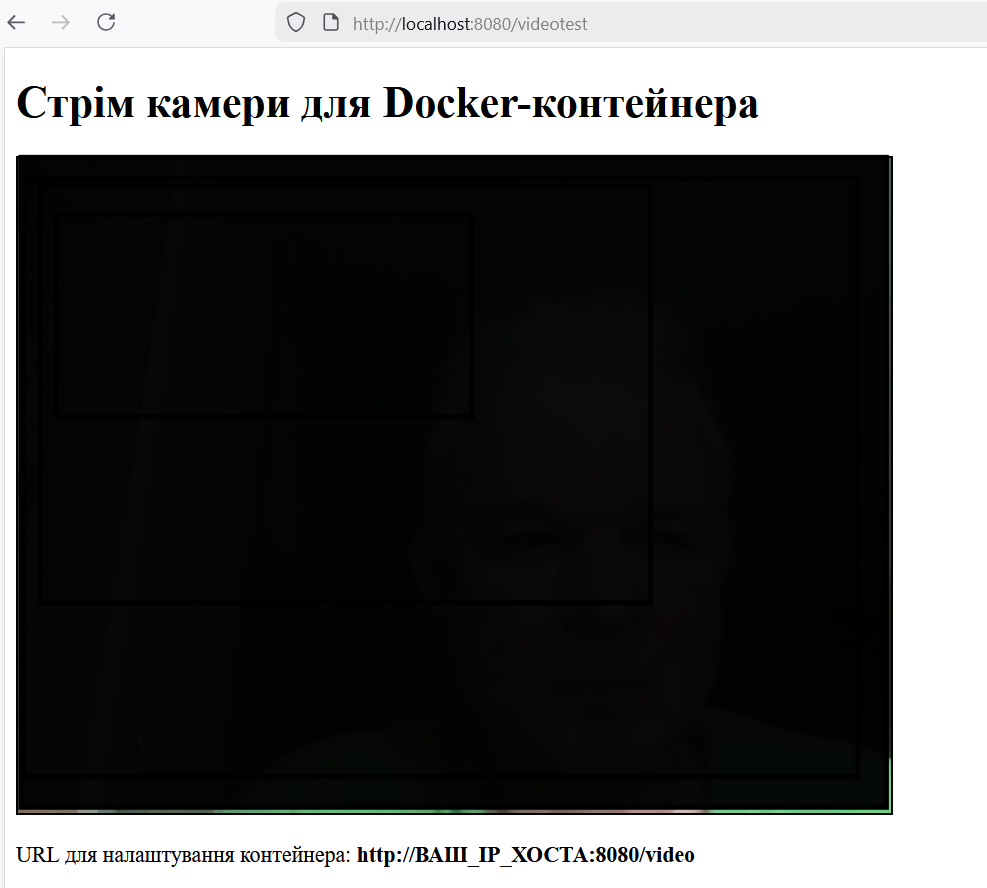
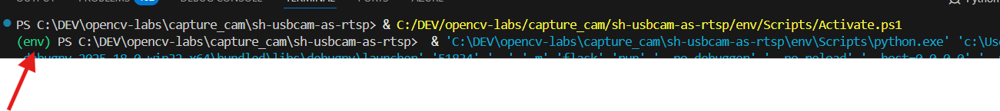
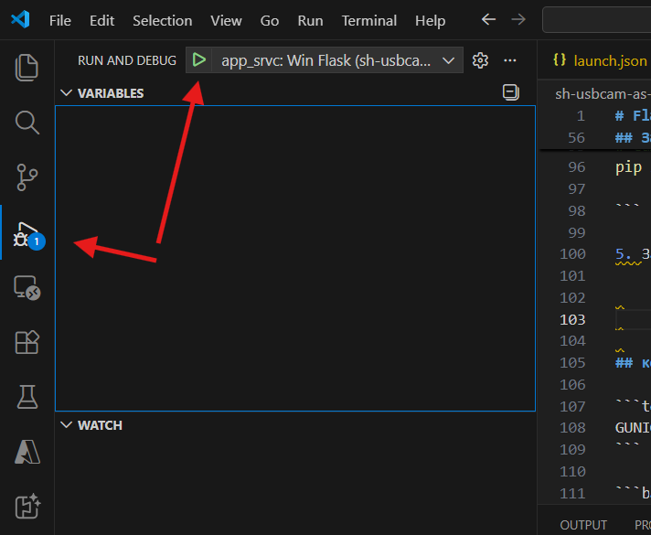

# Flask  додаток для емуляціі RTSP video потоку  за камери Notebook

## Призначення

Щоб працювати з ip  камерою через протокол RTSP  можна піти кількома шляхами:

- купити ip  камеру з підтримкою RTSP і підключити її до роутера;
- встановити на мобільний телефон додаток ip-камера і підключити телефон по WI-FI до того ж роутера;
- використати вбудовану камеру Laptop.

Щоб використати вбудовану камеру Laptop  потрібно встановити RTSP-сервер.
Я пошукав сервери у вигляді python пакетів - кілька з них відмовилися ставитись (не те що запускатися). 
Тому пішов іншим шляхом, створив Flask Web App, що емулює RTSP трафік. Для дослідів мені цього вистачить. А розгортати повноцінний сервер RTSP  та конфігурувати його - я не захотів.

Тому, ціль цього додатку - емулювати RTSP трафік з камери Laptop на windows  машині. 


## Опис додатку

Передбачає, що запуск додатку виконується на Host  машині під windows.  А приймати RTSP  трафік можна уже  на інших комп'ютерах чи контейенрах. На приклад: на віртальних машинах, для яких Windows  є HOST машиною, кнтейнерах. 
Для дослідів додаток можна запустити  праямо з Visual Studio Code.

Після запуску, додаток буде доступний по URL: http://localhost:8080

<kbd></kbd>
<p style="text-align: center;"><a name="pic-01">pic-01</a></p>

Додаток має кілька endpoints, а саме:

- **Health chack**

Досутпний за url http://localhost:8080/api/health, http get. Повертає примітивний json:

```json
{
  "ok": true,
  "app_title": "Сервіс Flask "
}
```

- **Трансляція rtsp  з камери.**

Доступна за URL http://localhost:8080/video

Виконую примітивну трансляцію, без авторизації

- **Перевірка підключеня до камери**

Доступна за URL http://localhost:8080/videotest

Відкриває html сторінку з трансляцією з камери

<kbd></kbd>
<p style="text-align: center;"><a name="pic-02">pic-02</a></p>

## Запус додатку локально під windows

Вважаємо, що python  на laptop  вже встановлено

1. Склонувати  репозиторій на LapTop  командою git

```bash
 git clone <url  репозиторію>
```

2. Перейти в каталог репозиторію та створити virtual environment

```bash
python -m venv env
```

3. Активувати virtual environment

```bash
.\env\Scripts\activate.ps1
```

Якщо виникає помилка права доступу при запуску скрипта Activate.ps1, то потрібно запустити PowerShell с правами адміністратора і виконати команду

```bash
Set-ExecutionPolicy -ExecutionPolicy RemoteSigned -Scope CurrentUser 
```

На малюнку показана ознака, що активація пройшла успішно

<kbd></kbd>
<p style="text-align: center;"><a name="pic-03">pic-03</a></p>


4. Встановення залежностей

```bash

# обновити pip (якщо потрібно) 
python.exe -m pip install --upgrade pip

# Саме встановлення залежностей 
pip install --no-cache-dir -r requirements.txt  

```

5. Запуск додатку з Visual Studio Code

На малюнку показано, які кнопочки треба натиснути, щоб запустити додаток.

<kbd></kbd>
<p style="text-align: center;"><a name="pic-04">pic-04</a></p>


Далі, відкриваємо бразуер і переходимо на відповідні URL, що надані в опису додтаку.

